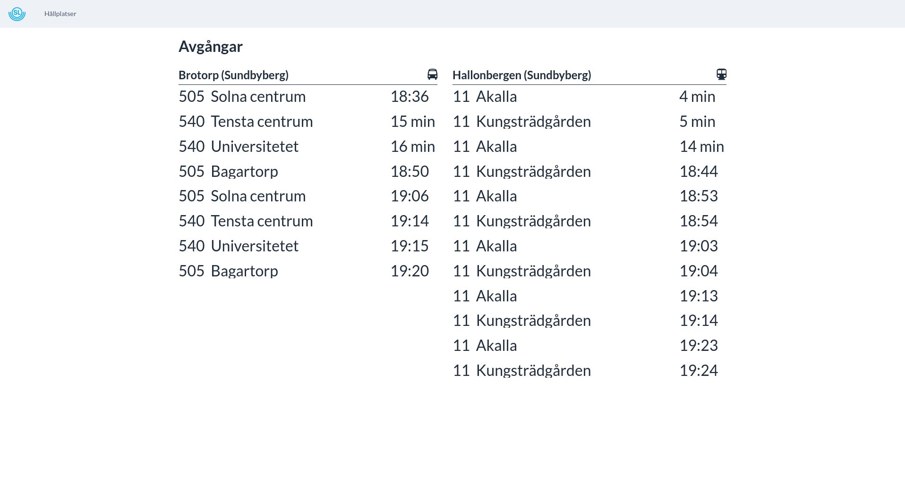

# SL Dashboard

Fetches realtime data from [trafiklab](https://www.trafiklab.se) for the selected stops.



The current version of the application can be run with docker-compose

```
docker-compose -f docker/docker-compose up
```

And then visit http://localhost:8088 in a browser.